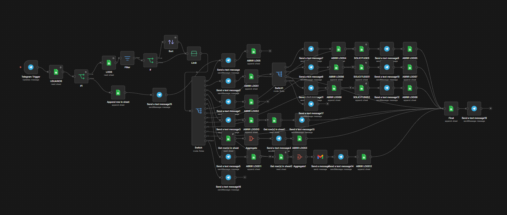

# 🤖 HelpDeskBot

Bot conversacional de soporte interno construido sobre **Telegram + n8n + Google Sheets**.



---

## 📋 Requisitos

- [Docker Desktop](https://www.docker.com/products/docker-desktop/) instalado
- [ngrok](https://ngrok.com/download) instalado y con cuenta activa
- Token de bot de Telegram ([@BotFather](https://t.me/BotFather))
- Cuenta de Google con acceso al Google Sheets `HelpDeskBot_DB`

---

## 🚀 Ejecución

### Windows

1. Abre **PowerShell** o **CMD** en la carpeta del proyecto:
   ```
   cd C:\ruta\del\proyecto
   ```

2. Levanta los contenedores:
   ```
   docker compose up -d
   ```

3. Verifica que estén corriendo:
   ```
   docker compose ps
   ```

4. Abre n8n en el navegador:
   ```
   https://musket-goon-chief.ngrok-free.dev
   ```

### Linux / Mac

1. Abre una terminal en la carpeta del proyecto:
   ```bash
   cd /ruta/del/proyecto
   ```

2. Levanta los contenedores:
   ```bash
   docker compose up -d
   ```

3. Verifica que estén corriendo:
   ```bash
   docker compose ps
   ```

4. Abre n8n en el navegador:
   ```
   https://musket-goon-chief.ngrok-free.dev
   ```

---

## 📥 Importar el workflow en n8n

1. Entra a n8n desde el navegador
2. Ve a **Workflows → Import from file**
3. Selecciona el archivo `HelpDeskBot_FINAL.json`
4. Activa el workflow con el toggle superior derecho ✅

---

## 🔗 Registrar el webhook de Telegram

Después de activar el workflow, ejecuta esta URL en el navegador reemplazando `<TOKEN>` con el token de tu bot:

```
https://api.telegram.org/bot<TOKEN>/setWebhook?url=https://musket-goon-chief.ngrok-free.dev/webhook/telegram
```

Verifica que el webhook esté registrado:

```
https://api.telegram.org/bot<TOKEN>/getWebhookInfo
```

Debes ver `"url": "https://musket-goon-chief.ngrok-free.dev/webhook/telegram"`.

---

## 🛑 Detener el bot

### Windows
```
docker compose down
```

### Linux / Mac
```bash
docker compose down
```

---

## 🗂️ Estructura del proyecto

```
📁 proyecto/
├── docker-compose.yml       # Configuración de Docker (n8n + ngrok)
├── HelpDeskBot_FINAL.json   # Workflow de n8n
├── flujo.png                # Captura del flujo
└── README.md                # Este archivo
```

---

## 🗃️ Modelo de datos (Google Sheets)

| Hoja | Columnas |
|---|---|
| **USUARIOS** | telegram_user, nombre, rol, activo |
| **SOLICITUDES** | id_ticket, tipo, prioridad, descripcion, estado, creado_por, fecha_creacion |
| **LOGS** | timestamp, telegram_user, pantalla, opcion, resultado |

---

## 🧩 Stack tecnológico

| Componente | Tecnología |
|---|---|
| Bot | Telegram Bot API |
| Motor de automatización | n8n Community Edition |
| Base de datos | Google Sheets |
| Tunnel | ngrok |
| Contenedores | Docker + Docker Compose |